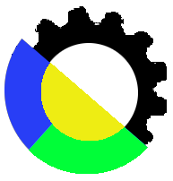

# geocogs

GeoCogs is an automatic data acquisition and statistics QGIS processing plugin developed in python and Google Earth Engine for processing the Remote Sensing data.

# Usage
Complete information on Installation and Usage of the plugin is provided in the [User Manual](https://docs.google.com/document/d/1lKlJJfnanIaSFlnZ2IZElMiYL7eh2eYEoO6vPVTY7c4/edit?usp=sharing).

# Prerequisites
User has to signup an account in Google Earth Engine and Google Earth Engine Plugin to be installed in QGIS for processing the Remote Sensing data. Detailed information available in the [User Manual](https://docs.google.com/document/d/1lKlJJfnanIaSFlnZ2IZElMiYL7eh2eYEoO6vPVTY7c4/edit?usp=sharing).

# Changelog
The changes made for different versions can be viewed in [CHANGELOG.md](https://github.com/balakumaran247/geocogs/blob/main/CHANGELOG.md).

# Troubleshoot
If any error encountered please try out the following,
1. Try exporting to the Drive
2. Reduce the number of years in the date range.
3. Change the scale and tileScale values as required.
4. Reduce the number of features in the Input layer.

# Screenshots
Boundary Statisics         |  LULC Statistics
:-------------------------:|:-------------------------:
|

